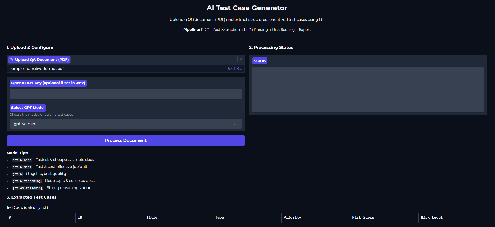
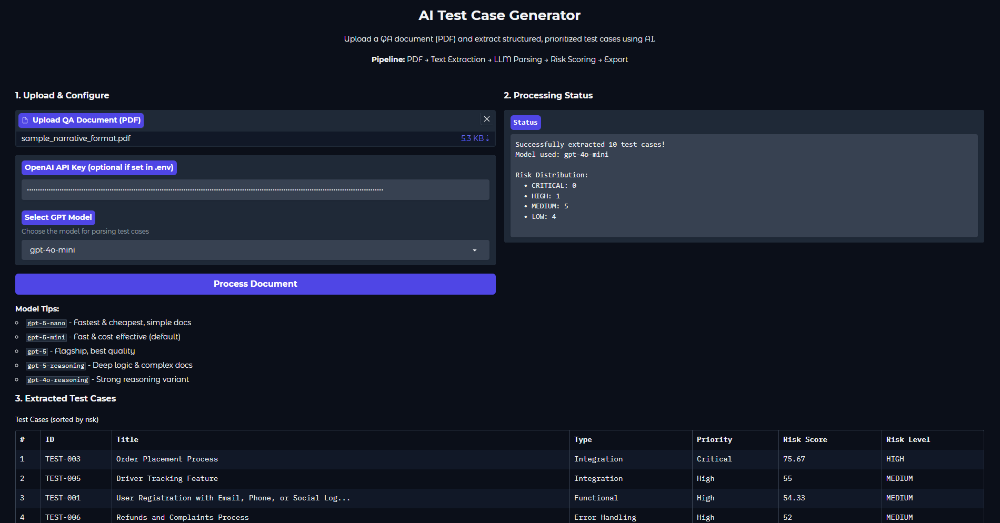
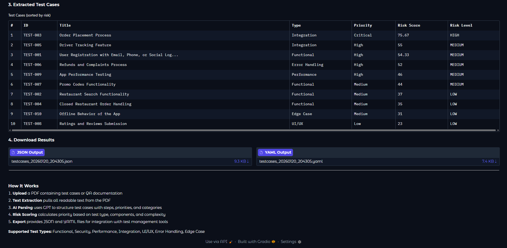

# AI Test Case Generator


Extract and prioritize test cases from QA documents using AI.

## Architecture

```
+-------------------------------------------------------------------+
|                         GRADIO WEB UI                             |
|                     (Upload PDF + Config)                         |
+--------------------------------+----------------------------------+
                                 |
                                 v
+--------------------------------------------------------------------+
|                       PROCESSING PIPELINE                          |
|                                                                    |
|   +-----------+    +-----------+    +-----------+    +----------+  |
|   |    PDF    |    |    LLM    |    |   RISK    |    |  EXPORT  |  |
|   |  EXTRACT  |--->|   PARSER  |--->|   SCORER  |--->|  MODULE  |  |
|   |(pdfplumber)|    |   (GPT)   |    | (Weighted)|    |(JSON/YAML) |
|   +-----------+    +-----------+    +-----------+    +----------+  |
|                                                                    |
+--------------------------------+-----------------------------------+
                                 |
                                 v
+-------------------------------------------------------------------+
|                       STRUCTURED OUTPUT                           |
|          Test Cases + Risk Scores + Execution Order               |
+-------------------------------------------------------------------+
```

## Features

- **PDF Text Extraction** - Parse any QA document format
- **AI-Powered Parsing** - GPT converts unstructured text to structured test cases
- **Risk Scoring** - Auto-prioritize by severity, type, and components
- **Multi-Format Export** - JSON and YAML outputs
- **Web UI** - Gradio interface for easy use

## Screenshots

### Upload & Configure

*Upload PDF, enter API key, select GPT model*

### Processing Results

*Status showing extracted test cases with risk distribution*

### Extracted Test Cases & Export

*Test cases sorted by risk score with JSON/YAML download options*

## Quick Start

```bash
# Setup
python -m venv venv
venv\Scripts\activate        # Windows
source venv/bin/activate     # Linux/Mac

pip install -r requirements.txt

# Configure
copy .env.example .env       # Add your OpenAI API key

# Run Web UI
python app.py
# Open http://127.0.0.1:7860
```

## Web UI

```bash
python app.py
```

Features:
- Upload PDF documents
- Select GPT model (gpt-5, gpt-5-mini, gpt-4o, etc.)
- View extracted test cases in table
- Download JSON/YAML results

## CLI Usage

```bash
# Run full pipeline
python run_pipeline.py

# Run individual steps
python src/ocr_extractor.py      # Extract text
python src/llm_parser.py         # Parse with GPT
python src/risk_scorer.py        # Calculate scores
python src/exporter.py           # Export results
```

## Project Structure

```
├── app.py                      # Gradio web UI
├── run_pipeline.py             # CLI pipeline runner
├── src/
│   ├── ocr_extractor.py        # PDF text extraction
│   ├── llm_parser.py           # GPT parsing
│   ├── risk_scorer.py          # Risk calculation
│   └── exporter.py             # JSON/YAML export
├── data/
│   ├── raw_docs/               # Sample PDFs included
│   ├── intermediate/           # OCR output
│   └── outputs/                # Final exports
└── requirements.txt
```

## Sample PDFs

Sample QA documents included in `data/raw_docs/` for testing:

| File | Format |
|------|--------|
| `sample_qa_doc.pdf` | Standard QA document |
| `sample_table_format.pdf` | Table-based layout |
| `sample_bullet_format.pdf` | Nested bullets/lists |
| `sample_narrative_format.pdf` | Paragraph style |
| `sample_chaotic_format.pdf` | Mixed/unstructured |

## Configuration

`.env` file:
```
OPENAI_API_KEY=sk-your-key-here
LLM_MODEL=gpt-5-mini
```

## GPT Models

| Model | Use Case |
|-------|----------|
| `gpt-5-nano` | Fast, simple docs |
| `gpt-5-mini` | Balanced (default) |
| `gpt-5` | Best quality |
| `gpt-5-reasoning` | Complex logic |
| `gpt-4o` | Previous gen |

## Risk Scoring

Formula: `Priority(40%) + Type(30%) + Components(20%) + Complexity(10%)`

| Category | Score |
|----------|-------|
| CRITICAL | 80-100 |
| HIGH | 60-79 |
| MEDIUM | 40-59 |
| LOW | 0-39 |

## Output Format

```json
{
  "metadata": {
    "export_date": "2025-01-20",
    "total_test_cases": 12,
    "risk_summary": {"critical": 2, "high": 4, "medium": 4, "low": 2}
  },
  "test_cases": [
    {
      "test_id": "TC-001",
      "title": "User Login",
      "test_steps": ["Navigate to login", "Enter credentials", "Click submit"],
      "expected_result": "Dashboard loads",
      "test_type": "Functional",
      "priority": "High",
      "risk_score": 72.5,
      "risk_category": "HIGH",
      "execution_order": 1
    }
  ]
}
```

## Technologies Used

### Core
| Technology | Purpose |
|------------|---------|
|  | Core programming language |
|  | GPT models for intelligent parsing |

### Web Interface
| Technology | Purpose |
|------------|---------|
|  | Interactive web UI framework |

### PDF Processing
| Technology | Purpose |
|------------|---------|
| **pdfplumber** | Text extraction from PDF documents |
| **PyPDF2** | PDF manipulation and reading |

### Data Export
| Technology | Purpose |
|------------|---------|
| **JSON** | Structured data output |
| **PyYAML** | YAML format export |

### Configuration
| Technology | Purpose |
|------------|---------|
| **python-dotenv** | Environment variable management |

## Requirements

- Python 3.10+
- OpenAI API key
